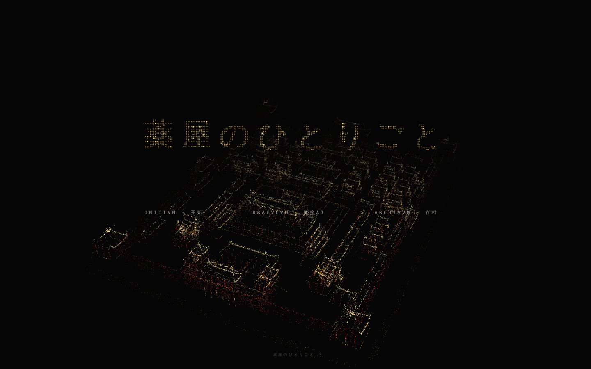
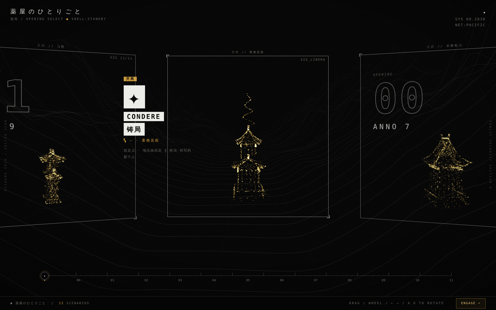
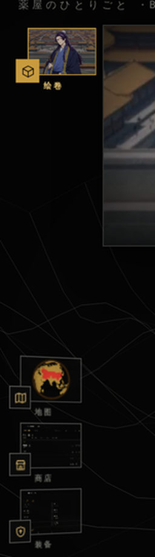
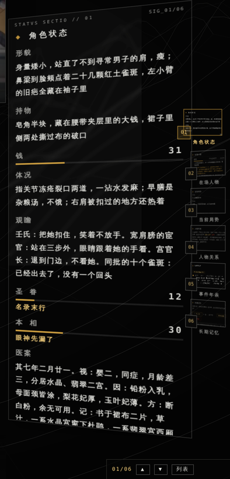
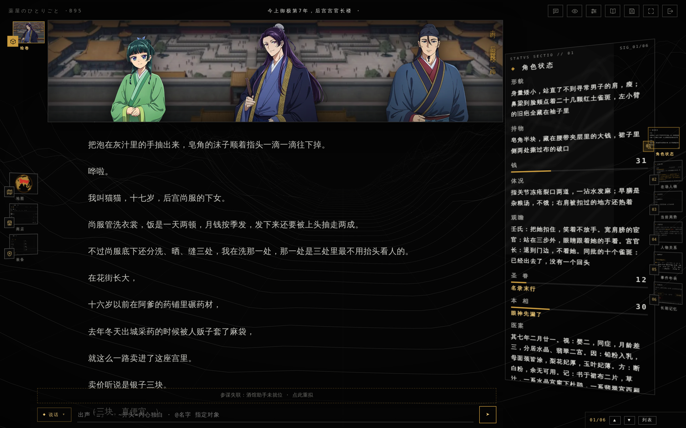
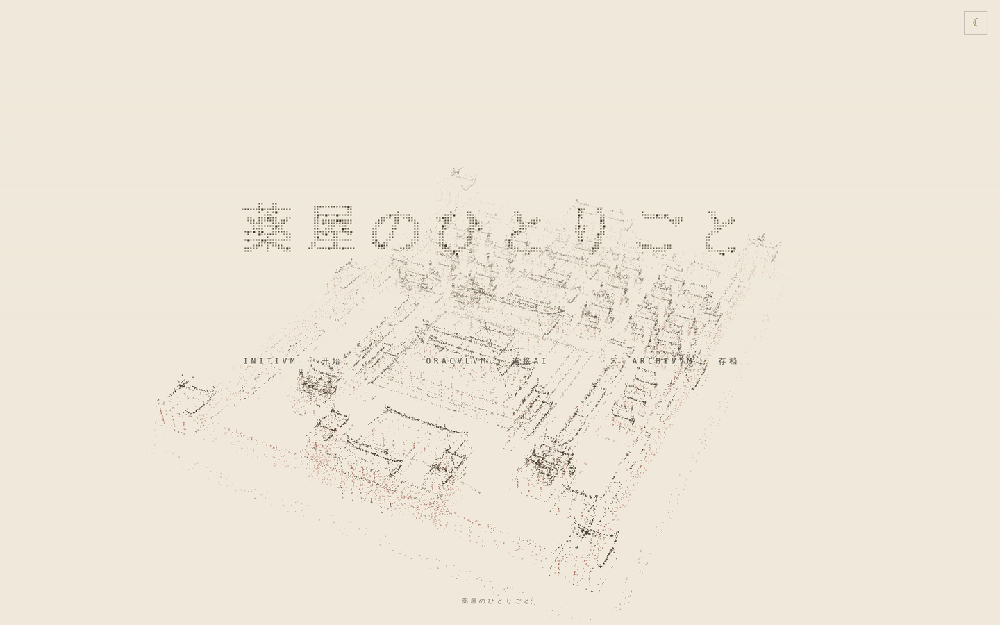

<div align="center">

# 薬屋のひとりごと

**THE APOTHECARY DIARIES**

</div>

---

> 今上御极第七年，茘国后宫。
>
> 你是猫猫——花街药铺长大的药师，被人贩子卖进宫当洗衣下女，每天早上往鼻梁上点雀斑给自己降价，一心只想熬满契约拿钱走人。
>
> 三个月前你看穿害死东宫的是妃子脸上的白粉，撕下裙角写了张字条匿名挂在窗边，写完就没回头。今天你被叫到宫官长楼，肩膀被一只手扣住，回头是那张笑脸和一句「怎么可以呢？」

## ✦ 起動 —— 粒子紫禁城

打开游戏的第一眼：一座紫禁城由 **34,629 枚粒子**在暗底上聚成。中轴一线从午门排到神武门，东西六宫分列两厢，四角楼、护城河、内金水河五桥各安其位——**153 座单体建筑、25 进院落**，全部实时生成，非预渲染图片。

配色不是随手调的，是**红墙黄瓦白台基**：朱红给城墙宫墙与柱，亮金给黄琉璃瓦顶，琥珀给汉白玉台基，暗金给地面与护城河。整座随呼吸般缓缓摆动，南面（午门）始终朝着看的人。



## ✦ 選局 —— 一张卡一座中国古建

点「INITIVM · 开始」，十三张开局卡排成一道 360° 环。每张卡的粒子不是装饰图案，是一座按清《工程做法》定制的中国古建筑，**屋顶形制对应开局的等级与气象**：



| | 形制 | | 形制 |
|---|---|---|---|
| 铸局（自定义） | 大式 · 重檐庑殿 | 06 怪談 | 大式 · 密檐塔 |
| 00 部屋付 | 大式 · 单檐歇山 | 07 診療所 | 小式 · 卷棚 |
| 01 看病 | 小式 · 硬山 | 08 避暑地 | 小式 · 八角攒尖 |
| 02 名簿 | 小式 · 悬山 | 09 鬼灯 | 大式 · 棂星门 |
| 03 薬田 | 小式 · 四角攒尖 | 10 蟇盆 | 小式 · 盝顶 |
| 04 中祀 | 大式 · 重檐歇山 | 11 砦 | 大式 · 阙楼 |
| 05 李白 | 大式 · 楼阁 | | |

大式有斗栱、小式没有——这是清代官式建筑真实的等级划分。屋顶的两笔关键都算了出来：**举折**（屋面不是斜直线，越靠脊越陡，压出一条凹弧）与**翼角起翘**（四角檐口往上翻、往外挑）。每张卡九百至一千九百枚粒子不等，随形制繁简增减。

## ✦ 十二个开局

正典章节顺序排布，猫猫五局、壬氏两局，另有梨花妃、翠苓、李白、子翠、玉叶妃各一局。跨度从御极七年到九年。

| # | 开局 | 年 | 你扮演 |
|---|---|---|---|
| 00 | 部屋付 | 七年 | 猫猫（药师，十七岁，后宫下女） |
| 01 | 看病 | 七年 | 梨花妃（贤妃，二十三岁，铅毒初愈） |
| 02 | 名簿 | 七年 | 壬氏（后宫总管宦官，对外二十四岁） |
| 03 | 薬田 | 八年 | 翠苓（军府官女，十九岁） |
| 04 | 中祀 | 八年 | 猫猫（外廷擦回廊的下女，十八岁） |
| 05 | 李白 | 八年 | 李白（王宫武官，二十来岁） |
| 06 | 怪談 | 八年 | 子翠（尚服的洗衣下女，十七岁） |
| 07 | 診療所 | 八年 | 玉叶妃（贵妃，十九岁，有孕五月） |
| 08 | 避暑地 | 八年 | 猫猫（壬氏府侍女，十八岁） |
| 09 | 鬼灯 | 九年 | 壬氏（皇弟华瑞月，十九岁） |
| 10 | 蟇盆 | 九年 | 猫猫（药师，十九岁，被掳北上） |
| 11 | 砦 | 九年 | 猫猫（药师，十九岁，随军在砦） |

每个开局配一段导览：时间、地点、你是谁、现在的局面、下一句话要决定什么——没读过原作也能三十秒上手。

另有**铸局（自定义开局）**：转动地球自己拣一处落脚，再写一个自己的人物。

## ✦ 影像岛 —— 视觉小说系统

灵动岛即舞台：官方立绘，谁在场谁登场。


- **在场之人 = 立绘在框**：每 330ms 从状态栏读一次在场名单，按别称「长词优先」匹配，至多四人同框；你扮演的那一位恒在最前层
- **像素显形进场**：角色以 64 格随机像素块逐格显形（0.5 秒、t² 缓动、0.2 秒延迟）
- **十四位立绘**：猫猫、壬氏、高顺、玉叶妃、梨花妃、里树妃、楼兰妃、小兰、庸医、李白、罗汉、子翠、阿多妃、翠苓。每人带一组口语别称索引——喊「雀斑的下女」认得是猫猫，说「月之君」认得是壬氏
- **场景自动匹配**：35 张背景按剧情◇时地逐轮匹配切换，带昼夜判别与滞回防闪切
- **身高归一**：每位角色带一个身高系数，同框时比例不会失真

## ✦ 台前调度 —— 四扇缩略窗

左栏是照 iPadOS「台前调度」做的一列**斜着的小窗**，每一枚是那个抽屉的**真实缩略图**，不是示意图标。点一下，对应的抽屉滑出来；正在开着的那一枚转正、贴金边、往右挪一点。



| 窗 | 内容 |
|---|---|
| **绘卷** | 当前影像岛的实时缩略——背景与立绘按台上真实位置合成，比例锁死 |
| **地图** | TABVLA · 转动的点阵地球，茘国疆域标红 |
| **商店** | MERCATVS · 采买与药材 |
| **装备** | ARMA · 随身之物 |

## ✦ 情報台 —— 逐栏说明

右栏六页翻册，每一页随剧情逐轮实时结算。



| 页 | 内容 |
|---|---|
| **01 角色状态** | 形貌 / 持物 / 钱 / 体况 / 观瞻五栏，外加两条量表与一份医案 |
| **02 在场人物** | 此刻同框者与各自的姿态 |
| **03 当前局势** | 本幕的局面与压在真相前面的体面 |
| **04 人物关系** | 出场人物结成的关系网，点选查看心向 |
| **05 事件年表** | 编年时间轴，剧情大事自动归档 |
| **06 长期记忆** | 记忆条：自动提炼 + 手动钉选，跨越上下文长度保持人设与伏笔 |

### 两条核心量表

游戏不用血条和等级，用两条更贴题的量表——它们由剧情驱动，不可手动加点：

**圣眷** —— 你在这后宫里被谁记得、被谁离不开。

| 档 | 状态 |
|---|---|
| 0 | 名录末行 |
| 25 | 有人记得名字 |
| 50 | 被点名当差 |
| 75 | 贵人离不开 |
| 95 | 一句话动得了后宫 |

**本相** —— 你藏得住多少。猫猫的毒物癖、壬氏的皇弟身份、翠苓的来路，都在这条上。

| 档 | 状态 |
|---|---|
| 0 | 皮还好好穿着 |
| 25 | 眼神先漏了 |
| 50 | 手比脑子快 |
| 75 | 当众露了本相 |
| 95 | 不装了 |

**天时·心象** —— 当日天气配一句实景，风、雪、晴、阴、雨各有其词：「日头把琉璃瓦晒得发白，是晾药的好天」。

**医案** —— 一栏专供病例与验毒记录，按干支纪日写：症、因、方、记四段俱全。

## ✦ 作战全景

进入游戏即是三栏：左栏台前调度，中栏正文，右栏情報台。



- **行动三模式**：说话 / 行动 / 敕令。说话分**出声**与**内心独白**两轨，`@名字` 指定对象
- **顶栏八键**：幕间乐、密语频道、接入 AI、设置、世界书、存档、全屏、离开
- **正文排版**：竖排标题、汉字点阵、和风衬线——版式照日译中小说的开本走

## ✦ 奶油主题

一键切换整套奶油色纸面主题。不是简单反色——每一个色值都按 **WCAG 对比度守恒**重新映射：同一族颜色在新底色上保持原有的对比度比值，高对比区做幂律压缩，彩色重音映射进 3.2–6.6 的安全区，投影另走一条暖褐通道。画布那半边（粒子、地球、导轨）CSS 管不着，另有一套调色表跟着切。



## ✦ 世界书

内嵌 **586 条**设定条目，分十五卷，每轮按关键词、在场人物、当前地点与剧情进度分层注入。

| 卷 | 主题 |
|---|---|
| core · a1 · a3 | 茘国建制、疆域诸州、朝廷官制 |
| a2 · a7 | 后宫规模、四夫人、园游会与席次 |
| a4 | 花街烟花巷、绿青馆、破屋区 |
| a5 · b1 | 铅白粉与毒白粉、皇子夭折案 |
| a6 | 试毒役、银杯、毒见役加给 |
| a8 · a9 · a10 | 猫猫身世、玉叶妃与翡翠宫、今上 |
| c1 · c2 · c3 | 声口卷：猫猫的断语与阿爹的教诲、壬氏的天女笑靥、十四人立绘口吻 |

条目带**口语别名索引**与**异体字归并**——说「药屋的娘子」命中猫猫，写「荔国」也认得是茘国。

## 怎么玩

游戏本身**不自带 AI**，你接入自己的接口来驱动世界：

1. 打开在线地址，或用浏览器打开本仓库的页面文件。
2. 在「ORACVLVM · 接入神谕」中填入你自己的接口地址与密钥（OpenAI / Anthropic / Gemini 兼容格式均可）。
3. 选一个开局，开始。

存档、记忆、密钥等一切数据仅存于你的浏览器本地，不上传、无服务器、无数据库。

- **酒馆生态兼容**：SillyTavern 角色卡（PNG/JSON）、世界书高级字段、正则脚本、预设导入
- **设置十二页**：显示 / 生图 / 语音 / 角色卡 / 世界书 / 正则 / 脚本 / AI接口 / 预设 / 记忆 / 备份 / 图库
- **离线可用**：出卡时所有立绘与背景内嵌为 data URI，装成 PWA 后断网照跑

## 仓库结构

```
core/            引擎与内嵌资材（立绘、背景、字体、图标）
st/data/         剧本数据
  openings/      12 个开局正文
  lore/          15 卷世界书，共 586 条
  meta.json      面板规格与角色卡字段
  briefs.json    开局导览
st/front/        构建产物：可直接打开的页面
tools/           构建链（build.sh → cardbuild → stcard → stfront → stpng）
docs/media/      本文档的截图
```

## 构建

```sh
sh tools/build.sh 1
```

从引擎文档派生出前端页面与 SillyTavern 角色卡（PNG）。构建带**回读自证**：抠掉注入段后与源文档逐字节比对，不一致即报错。

## 第三方组件

| 组件 | 用途 | 许可 |
|---|---|---|
| [three.js](https://threejs.org) | 三维渲染 | MIT |
| [ambientCG](https://ambientcg.com) | 纸张材质贴图 | CC0 |

## 原作与素材

日向夏《薬屋のひとりごと》（しのとうこ 插画，主婦の友インフォス／ヒーロー文庫）；漫画版（スクウェア・エニックス／小学館）；同名动画。本作为同人作品，仅供学习交流，与上述权利方无任何关联。

**立绘与背景素材版权归原权利方所有，不在本仓库的开源许可范围内**，详见 [LICENSE](LICENSE) 第 4 条。

## 免责声明

- 本项目为**纯前端静态页面**，不内置、不提供、不转售任何人工智能服务，亦不代理任何第三方 AI 接口。
- 玩家自行接入的第三方 AI 服务，其配置、费用、可用性及**由此生成的一切内容**均由玩家本人负责，与本项目及其维护者无关。
- 所有游戏数据（存档、密钥、记忆）仅保存在玩家本地浏览器中；本项目不收集、不存储、不传输任何用户数据。
- 游戏内文本由玩家接入的 AI 实时生成，不代表本项目立场。

## License

见 [LICENSE](LICENSE)。代码开放、禁止商用；原作相关名称、设定与美术素材的权利归属其各自权利方。

## 联系

问题反馈与建议：ekibenya@outlook.com
